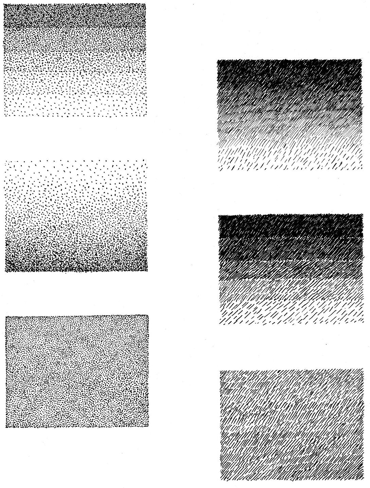

# Методические указания к выполнению практической работы №1

## Тема: Техники пуантель и штриховая

**Цель работы:** Освоение приемов выполнения техник – пуантель и штриховая

**Материально-техническое оснащение:**

*   чертежные принадлежности;
*   ватман формат А4;
*   тушь, чертежное перо.

### 1 Общие теоретические сведения

Название техники – пуантель происходит от французского слова- point – точка. Основными изобразительными средствами этой техники являются незначительные по своим размерам элементы – точки, которые в совокупности дают удивительные по выразительности результаты. Техника эта применяется в основном для изображения небольших архитектурных объектов, элементов предметного мира, фрагментов зданий, генпланов. Возможности пуантели при выявлении свето-теневой моделировки сравнимы с аналогичными свойствами тушевой отмывки. При этом пуантель более мобильна, поддается корректировке.

Достаточна близка к пуантели по характеру выполнения степени возможностей свето-теневой проработки штриховая техника. При работе над упражнением предполагается выполнить по три прямоугольника размером 5x6 см в каждой технике. Прямоугольники вычерчиваются карандашом, тушью не обводятся. Один из прямоугольников разделен по горизонтали на пять полос шириной 1 см, каждая из которых должна отличаться от предыдущей полосы по тону. Последовательность исполнения аналогична той, которая используется в технике отмывки. Сначала покрывается полностью весь прямоугольник тоном, соответствующий первой полосе, затем, начиная со второй полосы, все остальные затемняются до достижения тональности второй полоски, и так далее последовательно, каждый раз отступая одну полосу, выполняется весь прямоугольник. Второй прямоугольник должен быть покрыт равномерно одним тоном, при этом необходимо стараться избегать сгущения или разрежения точек или штрихов, так как это создает иллюзию деформации плоскости листа, заданием же требуется достичь эффекта ровной поверхности. Заполнять прямоугольник необходимо последовательно набирая тон, как в технике отмывки. Третий прямоугольник должен быть покрыт таким образом, чтобы создался эффект равномерного лессировочного перехода от светлого к темному тону. Рекомендации по последовательности заполнения прямоугольников те же, что и при работе над первым и вторым сначала прокрыть всю плоскость самым светлым тоном, затем, немного отступив, равномерно отступая точки или штрихи, попытаться плавно перейти к более темному тону. Таким образом, за пять приемов необходимо достичь равномерного перехода от светлого к темному. Штрихи могут располагаться вертикально или под наклоном. В том и в другом случае можно предварительно наметить по линейке карандашом несколько линий, параллельных выбранному направлению, и затем корректировать по ним направление штриха.

Выполняется упражнение черной тушью чертежным пером или рапидографом (0.18; 0,25; 0,30; 0,35). Жидкая тушь отечественного производства разводится водой – ¼ от общего объема.

Пуантель можно выполнять рапидографами, дающими более широкую линию – 0,50 и 0,70, но при этом повышается сложность исполнения, так как при нанесении точек необходимо тщательно выдерживать интервал, в этом случае почти не возможна корректировка.

### 2 Задание

2.1 Выполнить упражнение в технике - пуантель.

2.2 Выполнить упражнение в штриховой технике.

### 3 Порядок выполнения работы

На формате А4 разместить по три прямоугольника размером 5x6 см в каждой технике.

Упражнение выполняется на бумаге формата А4.

### 4 Контрольные вопросы

4.1 Назовите изобразительные средства техники пуантель.

4.2 Перечислите, какие инструменты и материалы используются для выполнения упражнения?

### Пример выполнения практического задания

