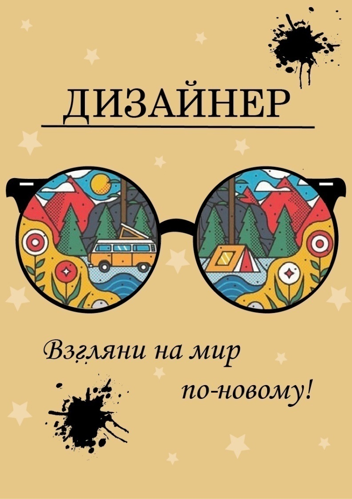

# Методические указания к выполнению практической работы №11

## Тема: Рекламный плакат

**Цель работы:** Освоение приема «коллаж» при выполнении рекламного плаката.

**Задачи работы:**

*   закрепить знания техники выполнения эскизов проектируемых объектов;
*   привить умения по выполнению рекламного плаката с использованием техник графики.

**Материально-техническое оснащение:**

*   чертежные принадлежности;
*   ватман, формат А 3;
*   [тушь](GLOSSARY.md#тушь), чертежное перо;
*   краски, кисти;
*   цветные [карандаши](GLOSSARY.md#карандаш);
*   цветная бумага, фотоматериалы, клей.

### 1 Общие теоретические сведения

«[Клаузура](GLOSSARY.md#клаузура) – [плакат](GLOSSARY.md#плакат)» относится к дизайнерским упражнениям, развивающим способности к исполнению авторских графических композиций. В процессе работы над плакатом формируются приемы изобразительного творчества. Исполнение плаката требует умения мыслить четко и грамотно, отражать композиционную идею в условной и лаконичной графической форме, оперировать обобщенными образами и понятиями. Плакатная [графика](GLOSSARY.md#графика) предполагает построение выразительных шрифтовых композиций с элементами ритма и метра, использование приемов условной обобщенной графики, средств объемного макетирования, аппликации, и коллажа с применением бумаги разного цвета и фактуры. Различают плакаты информационные и рекламные. Рекламный плакат – средство печатной рекламы или красочное рекламное издание относительно большого формата. Плакат должен быть простым, понятным, выразительным и решать конкретную задачу. При создании макета плаката важно помнить, что он должен подходить для сильного увеличения и соответствовать технологическим возможностям печати. Каждый плакат по размеру должен быть рассчитан на восприятие с определенного расстояния.

Основными составляющими плаката являются: визуальный [образ](GLOSSARY.md#образ), слоган и цвет.

_Визуальный образ_ – главный элемент плаката, и от того, как этот [образ](GLOSSARY.md#образ) воздействует, зависит, будут ли плакат замечать и запоминать. Основные качества плаката – это лаконичность и емкость, поэтому при разработке нежелательно использовать много мелких элементов. Существенное влияние на восприятие плаката, его действенность, оказывают правильно подобранные цветовые комбинации. Прекрасная идея и ее дизайнерское воплощение могут потеряться, если выбор цветов не будет оптимален. Чаще всего плакаты бывают многокрасочные, но из-за применения 8-10 красок плакат может потерять свою выразительность. Цвета должны быть как можно более сочными и яркими, чтобы бросаться в глаза, привлекать внимание. Использование цветового контраста позволяет сделать сюжет более запоминаемым и легко читаемым с далекого расстояния.

_«Чем меньше — тем лучше»_. В плакатах не должно быть мелких моментов, не должно рябить. Простота помогает сразу осознать смысл изображения. Создание такой рекламы заставляет отбросить всю чепуху, все ненужные детали, все лишнее и сфокусировать все внимание на идее. Поэтому часто говорят, что наружная реклама не просто реклама больших размеров, а реклама больших идей. Сначала появляется идея, а затем решаются технические вопросы возможности ее воплощения. Существует некоторые базовые правила создания рекламы:

* _Уникальность предложения._ Правило, которое гласит: Рекламное объявление должно содержать предложение: «Купи именно этот товар или услугу и получишь специфическую выгоду». Предложение должно выглядеть уникальным, быть вне конкуренции.
* _Интенсивность._ В печатной рекламе это чаще всего значит заголовки больших размеров. Текст должен быть коротким и намекать на продолжение.
* _Движение (динамичность)._ Реклама не должна выглядеть статичной, в печатной рекламе лучше всего использовать кадры «с продолжением», момент движения.
* _Контрастность и размер._ Довольно легкое в использовании правило. Очень эффективен для привлечения внимания.
* В большинстве случаев самым важным является _слоган или заголовок объявления._

Существуют следующие рекомендации по созданию: заголовок должен быть информативным, он должен содержать как минимум четверти всей важной информации, которую надо донести до человека. Идею следует передавать без «лишних слов». Информация, не относящаяся к объекту рекламы, снижает эффективность рекламы.

Правила изображений в печатных объявлениях:

* [Иллюстрация](GLOSSARY.md#иллюстрация) и текст должны взаимно дополнять друг друга. Если убрать текст, то объявление должно не менять смысла. [Изображение](GLOSSARY.md#изображение) должно демонстрировать потребителю будущее, в которое превратится настоящее после приобретения товара (услуги).
* Рекламное изображение не должно содержать художественных приемов, мешающих восприятию информации.
* В изображении должен существовать смысловой центр, если на ней присутствует человек, то он является этим центром.
* [Формат](GLOSSARY.md#формат) изображения должен быть таким, чтобы наиболее важные ее детали были видны.

Коллаж - это прием создания изображения на бумаге посредством монтажа кусочков различных материалов. Прием напоминает мозаику. В графике [коллаж](GLOSSARY.md#коллаж) обычно трактуется как сочетанием в одном изображении бумажных вклеек. Можно также использовать ткань и другие материалы.

Коллаж позволяет создавать выразительные фактурные эскизы, которые невозможно получить обычными графическими средствами. В графическом изображении техника коллажа позволяет более точно имитировать материалы, из которых проектируются модели одежды. Эскизы, выполненные в технике коллажа, обладают несколько обобщенным и условным изображением, пятновым восприятием формы. Эти особенности дают ряд преимуществ при разработке творческих эскизов, так как позволяют дизайнеру мыслить цельными формами, более смело решать задачи поиска новых форм. Техника коллажа позволяет достичь максимальной выразительности графических эскизов.

### 2 Задание

2.1 Выполнить рекламный плакат с использованием приема «коллаж»

### 3 Порядок выполнения работы

Упражнение выполняется на бумаге формата А3 с использованием приема «коллаж». По заданию преподавателя возможно выполнение различных видов рекламной печатной продукции. Коллаж используется в эскизах, как в чистой, так и смешанной технике. В смешанной технике к коллажу добавляют различные краски, прорабатывают форму линиями. Для удобства работы с коллажем можно предварительно нарисовать схему расположения фрагментов.

[Коллаж](GLOSSARY.md#коллаж) не должен быть перегружен большим количеством материалов.

Материалы, используемые при создании эскизов в технике коллажа:

* бумага (цветная, газетная, фотоизображения, калька и др.). Можно использовать также собственные выкраски, т.е специально подготовленные листы бумаги;
* текстильные материалы; 
* искусственные материалы;
* природные материалы.

Для работы с элементами коллажа можно использовать ножницы (аккуратно вырезать фрагменты), а можно разрывать бумагу, что придает [эскизу](GLOSSARY.md#эскиз) динамичность и выразительность.

Этапы создания рекламного плаката:

*   определение цветовой гаммы;
*   создание [фона](GLOSSARY.md#фон) плаката;
*   написание слогана;
*   подбор шрифта;
*   анализ результата и выявление ошибок;
*   исправление ошибок;
*   выполнение плакатов.

### Пример выполнения практического задания

