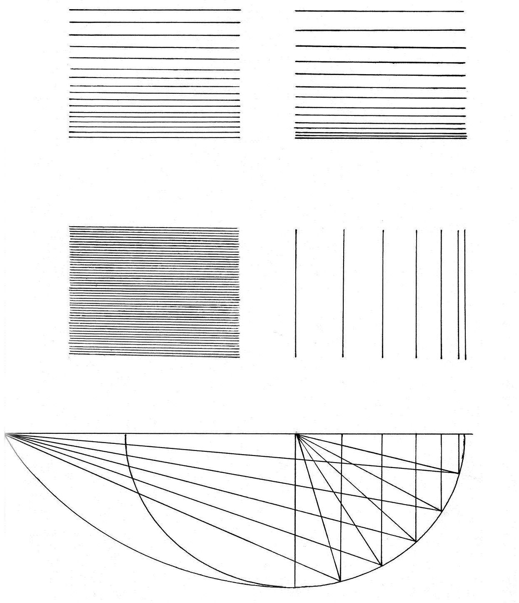
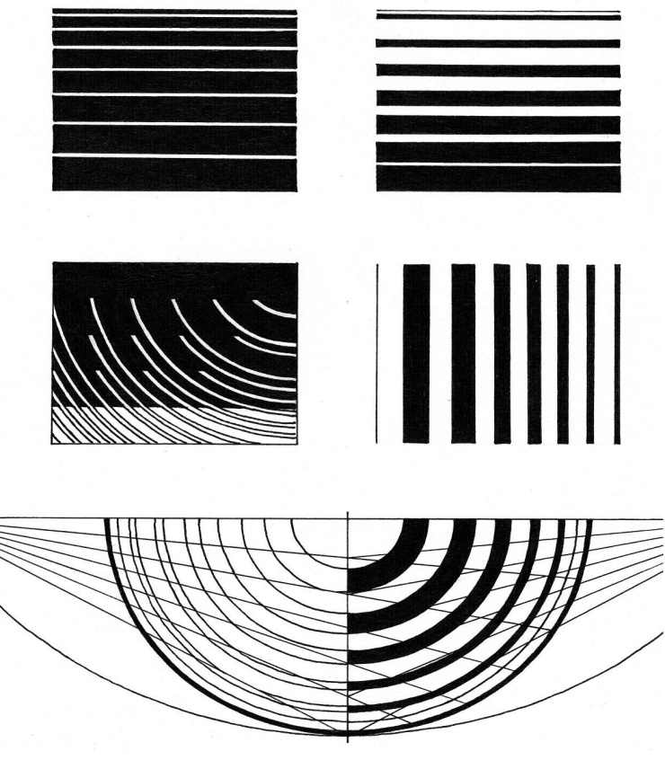

# Методические указания к выполнению практической работы №2

## Тема: Линейный растр. Техника (I, II).

**Цель работы:** Освоение приемов выполнения техники линейного растра (I, II)

**Задачи работы:**

*   закрепить знания по технике выполнения эскизов и чертежей проектируемых объектов;
*   привить умения по выполнению техники линейного растра (I, II)

**Материально-техническое оснащение:**

*   чертежные принадлежности;
*   ватман [формат](GLOSSARY.md#формат) А4;
*   [тушь](GLOSSARY.md#тушь), чертежное перо.

### 1 Общие теоретические сведения

Слово _raster_ – немецкое, произошло от латинского _raster или rastrum_ – грабли. В конце XIX века словом _растра_ или _раштра_ называли приспособление из пяти расположенных параллельных перьев, которыми разграфляли нотную бумагу.

В графике словом растр обозначают такой прием, когда тональность передается путем сгущения или разрежения одинаковых элементов ([точка](GLOSSARY.md#точка), [линия](GLOSSARY.md#линия), небольшая фигура более сложной формы) или же за счет изменения и варьирования размеров элементов и просветов между ними.

*Линейная техника растра* – одна из наиболее употребляемых и мобильных техник, используемая при изображении фасадов различных форм и масштабов. Основное требование к этой технике – умение выдерживать интервал между линиями.

**Линейный растр (I, II)**

Выполняется упражнение рапидографами (0,18; 0,25; 0,30; 0,35; 0,50) или хорошо подточенным рейсфедером черной тушью. При работе над заданием рекомендуется использовать инерционную рейсшину или другой чертежный прибор, гарантирующий параллельность вычерченных линий.

В верхней части листа вычерчиваются карандашом четыре прямоугольника, контуры которых не обводятся тушью. Один из прямоугольников делится на пять полос по одному сантиметру, каждая из которых заполняется параллельными линиями с уменьшением и интервала между ними на каждой из последующих полос. Второй прямоугольник заполняется параллельными линиями с минимальным постоянным интервалом. При тщательном выполнении прямоугольник представляет собой иллюзорно и параллельности линий появляется впечатление деформации плоскости листа.

Третий прямоугольник заполняется параллельными линиями с постоянным изменением интервала между ними. При этом достигается эффект равномерного изменения тона. Четвертый прямоугольник необходимо заполнить вертикальными линиями таким образом, чтобы достичь эффекта криволинейной поверхности. До этого представим себе, что вычерченный прямоугольник – ортогональная проекция на вертикальную плоскость четверти цилиндра. Начертим под ним его ортогональную проекцию на горизонтальную плоскость в виде четверти круга. Способом, используемым при членении плана колонны на каннелюры, разделим четверть окружности на шесть равных отрезков, затем каждый из отрезков дуги – пополам, и наконец эти членения поднимем проекционными линиями на вертикальную проекцию. Ритмическое сокращение интервала между ними создаст иллюзию криволинейной поверхности.

Способ разбивки окружности на равные отрезки выполняется с помощью циркуля рейсфедером или рапидографом, при этом возможны различные композиционные фантазии на тему окружности. Размещение на листе всех элементов задания также может быть композиционно осмыслено.

### 2 Задание

2.1 Выполнить упражнение в технике линейного растра (I).

2.2 Выполнить упражнение в технике линейного растра (II).

### 3 Порядок выполнения работы

**Техника линейного растра (I)**. На формате А4 разместите три прямоугольника размером 5x6 см, выполните горизонтальные линии в технике линейного растра, четвертый прямоугольник заполнить вертикальными линиями. Начертить под четвертым прямоугольником его ортогональную проекцию на горизонтальную плоскость в виде четверти круга.

Упражнение выполняется на бумаге формата А4. Пример выполнения работы представлен в приложении А.

**Техника линейного растра (II)**. В отличие от первого упражнения, в этой работе, выполняемой также в технике _растра_, тональные переходы осуществляются за счет изменения, как толщины линии, так и интервала между ними. Первый прямоугольник, также как и в предыдущих упражнениях, разбивается на пять сантиметровых полос и заполняется линиями или полосами различной ширины, в это время как интервалы между ними сохраняются одинаковыми.

Второй прямоугольник должен быть заполнен таким образом, чтобы создался эффект плавного затемнения за счет увеличения толщины горизонтальных полос сверху вниз одновременно с уменьшением интервала между ними.

Третий прямоугольник имитирует криволинейную поверхность. Представим эту поверхность также как и в предыдущем задании, четвертого цилиндра. Использовав, прием членения окружности на равные отрезки, разделим четверть ее на шесть равных частей, затем разделим эти отрезки еще пополам, а в получившихся в свою очередь, выделим одну треть. Подняв проекционными линиями полученные членения на вертикальную ортогональную проекцию (заданный прямоугольник), зальем тушью промежутки между вертикальными проекционными линиями, чередуя черные и белые полосы (2/3 отрезка будет соответствовать черная полоса, 1/3 – белая).

Четвертый прямоугольник предлагается заполнить любым видом _растра_, линейного или с использованием небольших произвольных элементов, при этом пытаясь добиться тонального перехода за счет изменения размеров элементов и просвета между ними. Далее приводятся фрагменты студенческих работ, демонстрирующие различные варианты _растра_, а также приемы вариаций композиционных обработок графического способа членения окружности.

> Упражнение выполняется на бумаге формата А4.

### 4 Контрольные вопросы

4.1 Дайте понятие линейный растр.

4.2 Перечислите, какие инструменты используются для выполнения упражнения?

4.3 Расскажите, как осуществляются тональные переходы между линиями в технике линейного [растра](GLOSSARY.md#растр) (II)?

### Пример выполнения практического задания

