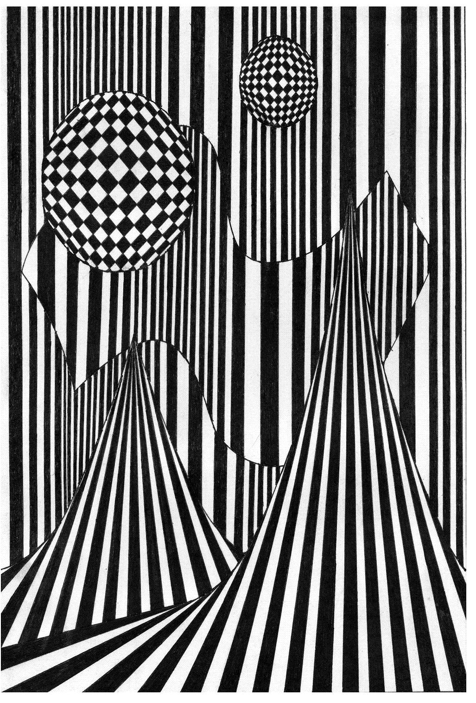

# Методические указания к выполнению практической работы №3

## Тема: Графическая композиция

**Цель работы:** Освоение техники выполнения графической композиции

**Задачи работы:**

*   закрепить знания по технике выполнения эскизов и чертежей проектируемых объектов;
*   привить умения по выполнению графической композиции.

**Материально-техническое оснащение:**

*   чертежные принадлежности;
*   ватман формат А3;
*   подрамник;
*   [тушь](GLOSSARY.md#тушь), чертежное перо.

### 1 Общие теоретические сведения

Раскрывая особенности композиции в станковой и книжной графике, следует сказать, что они опираются на всеобщие законы композиции, распространяющие свое действие на все виды изобразительного искусства.

Главная особенность графического искусства в целом – главенствующая роль рисунка, использование прежде всего графических материалов (карандаш, [уголь](GLOSSARY.md#уголь), [тушь](GLOSSARY.md#тушь), [сангина](GLOSSARY.md#cангина), [соус](GLOSSARY.md#соус) и др.) и соответственно технических средств графики ([линия](GLOSSARY.md#линия), штрих, [пятно](GLOSSARY.md#пятно) и т. д.), приемов (символ, гипербола, гротеск, аллегория и т. д.).

В графике преобладает ахроматические тона, хотя графические произведения в цвете (эстампы, иллюстрации) бывают достаточно живописными.

**Эста́мп** (фр. _estampe_, от итал. _stampa_) — произведение [графического искусства](http://ru.wikipedia.org/wiki/%D0%93%D1%80%D0%B0%D1%84%D0%B8%D0%BA%D0%B0), представляющее собой [гравюрный](http://ru.wikipedia.org/wiki/%D0%93%D1%80%D0%B0%D0%B2%D1%8E%D1%80%D0%B0) либо иной оттиск на бумаге с печатной формы (матрицы).

**Иллюстрация** (от лат. _illustratio_ — наглядное [изображение](GLOSSARY.md#изображение)) – изображение, сопровождающее и дополняющее текст (рисунки, [гравюры](GLOSSARY.md#гравюра), фотоснимки, репродукции, карты, схемы и т. п.).

[Графика](GLOSSARY.md#графика) еще более условна, чем живопись, в которой реальные цветовые качества предмета имитируются цветовыми, колористическими средствами. В графическом искусстве эти же реальности передаются черно-белым рисунком (линейным, штриховым, контурным).

В графике композиция строится, как и в живописи, на основе образно-пластического решения темы, сюжета. В графике также имеет значение тональная проработка всего изображаемого. Стоит отметить, что небольшие полутени техникой штриха показывают плавность перехода от тени к свету, создавая впечатление реальности предмета.

Реалистичности также можно добиться, изображая предметы в декоративной манере, объем предмета и пространство передаются средствами светотени или цвета в плоскостном решении. Иллюзия объемности изображаемого в таких случаях достигается с помощью рисунка, который образует контуры формы.

Используя традиционные [изобразительные средства](GLOSSARY.md#изобразительное-средство) графики линию, [пятно](GLOSSARY.md#пятно), точку, создать оптический эффект деформации плоскости листа.

Это упражнение преследует собой две цели – с одной стороны необходимость проявления творческих, сочинительских способностей, с другой стороны – грамотная, качественная фиксация графических фантазий. Практическая ценность этого упражнения состоит в осмыслении студентом широких возможностей графического языка, с помощью которого могут быть реализованы различные эффекты пространственных, объемных и фронтальных композиций. Значение этих возможностей графики и умение пользоваться ими, несомненно будет востребовано в профессиональной деятельности дизайнеров.

### 2 Задание

2.1 Выполнить эскиз графической композиции в карандаше.

2.2 Выполнить эскиз графической композиции в графике.

### 3 Порядок выполнения работы

На формате А3 используя традиционные [изобразительные средства](GLOSSARY.md#изобразительное-средство) графики линию, [пятно](GLOSSARY.md#пятно), точку, необходимо создать оптический эффект деформации плоскости листа. Предварительно эскиз графической композиции выполняется в карандаше, затем выбираются изобразительные техники графики для передачи оптической иллюзии

### 4 Контрольные вопросы

4.1 Дайте понятие [эстамп](GLOSSARY.md#эстамп).

4.2 Дайте понятие [иллюстрация](GLOSSARY.md#иллюстрация).

4.3 Какие приемы используются для выполнения графической композиции?

### Пример выполнения практического задания

