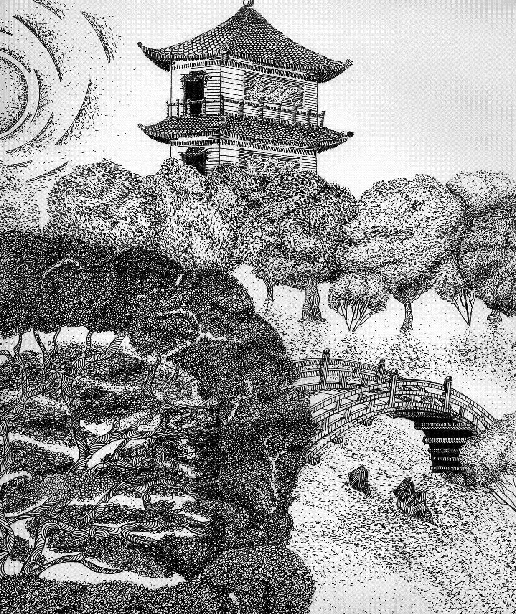

# Методические указания к выполнению практической работы №4

## Тема: антураж и стаффаж

**Цель работы:** Изображение антуража и стаффажа с учетом композиционного размещения на плоскости листа.

**Задачи работы:**

*   изобразить [антураж](GLOSSARY.md#антураж) в ортогональной проекции без перспективных сокращений;
*   выполнить [изображение](GLOSSARY.md#изображение) транспортного средства, людей, животных с элементами пейзажа;
*   продемонстрировать индивидуальный стиль изображения антуража и стаффажа.

**Материально-техническое оснащение:**

*   чертежные принадлежности;
*   ватман формат А3;
*   подрамник;
*   [тушь](GLOSSARY.md#тушь), чертежное перо.

### 1 Общие теоретические сведения

[Антураж](GLOSSARY.md#антураж) – французское слово _entourage_, переводится как окружение, обстановка, в архитектурном чертеже – фрагменты пейзажа.

Изображение антуража при демонстрационной подаче преследует несколько целей. Во- первых, дает представление об окружающей среде, демонстрирует органичность взаимодействия с ней проектируемого объекта. Во-вторых, дает информацию о масштабности сооружения, так как элементы природного окружения служат сравнительными ориентирами в визуальном определении размеров объекта. И, наконец, мастерски выполненные изображения элементов антуража свидетельствует о профессиональном уровне автора, демонстрирует его индивидуальный стиль. При изображении дерева играет большую роль умелая стилизация и условность рисунка, предпочтение отдается силуэтному изображению с минимумом деталировки.

Стилизация– упрощенный четкий контрастный линейный рисунок, в основе которого лежит [штрих](GLOSSARY.md#штрих), [пятно](GLOSSARY.md#пятно), [линия](GLOSSARY.md#линия). Упрощенность, лаконизм - характерная черта стилизованного рисунка. Чтобы стилизовать рисунок, нужно отобрать основные, характерные черты изображаемого предмета. Ими могут служить характерный объем отображаемого предмета, характерные линии и формы. Когда они найдены, начинается работа над стилизацией предмета. Минимальными графическими средствами из основных характерных черт &quot;составляется&quot; картинка. При стилизации не передается объемно пространственное построение. В роли пространства выступает бумага. Художник-график может ограничиться и беглым впечатлением, условным обозначением предмета, как бы намёком на него - незаконченность и лаконизм при этом служат одними из главных средств выразительности. Стилизация используется в логотипах, [плакатах](GLOSSARY.md#плакат), орнаментах, шаржах - здесь наиболее задействована стилизация, как главное средство выражения идеи. Стилизация может проявляться и в живописи. Ее начали применять в работах художники с середины XX века. Стилизация имеет место быть не только в передаче форм, но и цвета. Вспомните работы Микеланджело, и вспомните работы Кандинского.

Если вы хотите научиться искусству стилизации, начинайте с малого. Попробуйте сделать стилизованный рисунок растения. Подсолнух, гроздь винограда, ветка дерева - что угодно. Сначала порисуйте наброски. Изучите растение, прочувствуйте его характерную форму - чем это растение отличается от других. Выделите эти основные характерные черты. Если этот этап работы сделан, начинайте работать над стилизацией данного растения. Как уже было сказано раньше, в рисовании можно использовать штрих, линию, [пятно](GLOSSARY.md#пятно). Выберите для себя малое - [пятно](GLOSSARY.md#пятно) и [линия](GLOSSARY.md#линия), штрих и [линия](GLOSSARY.md#линия), работа одним пятном. Дальше идет дизайн. Вы должны придумать интересную форму растению, красивую картинку. Но в любом случае, какой стилизованный рисунок у вас бы не получился, растение должно быть узнаваемым. Чем интересна стилизация, так это тем, что вы можете образно передать &quot;портрет&quot; растения, как бы пропустить рисунок через призму собственных ощущений и придать ему лаконичности, поэтичности, неповторимости. Стилизованный рисунок - это плод игры вашего воображения.

Стилизацию можно применять не только при изображении растений. К стилизации можно прибегать абсолютно во всем. Портрет, пейзаж, натюрморт, любая композиция - может быть использована стилизация.

Стаффаж – от немецкого слова _staffage_ – украшать картины фигурами. В пейзажной живописи – фигуры людей и животных, а в архитектурном чертеже – [изображение](GLOSSARY.md#изображение) транспортных средств, людей и животных.

Изображение стаффажа при демонстрационной подаче преследует несколько целей. Во - первых, дает представление об окружающей среде, демонстрирует органичность взаимодействия с ней проектируемого объекта. Во-вторых, дает информацию о масштабности сооружения, так как человеческая фигура, транспорт, элементы природного окружения служат сравнительными ориентирами в визуальном определении размеров объекта. И, наконец, мастерски выполненные изображения элементов стаффажа свидетельствует о профессиональном уровне автора, демонстрирует его индивидуальный стиль.

При выполнении задания необходимо изобразить средство транспорта и человеческую фигуру в одном масштабе (1:50; 1:40), все эти элементы должны быть представлены в ортогональной проекции на линии первого плана без перспективных сокращений относительно друг друга, с учетом композиционного размещения на плоскости листа. На втором плане могут быть размещены элементы пейзажа. Транспортные средства необходимо вычертить с тщательным соблюдением их размеров. При изображении человеческой фигуры большую роль играют умелая стилизация и условность рисунка, предпочтение должно быть отдано силуэтному изображению с минимумом деталировки. В работе над этим упражнением необходимо реализовать творческое отношение к заданию.

### 2 Задание

2.1 Выполнить [Антураж](GLOSSARY.md#антураж) на формате А3; представить в ортогональной проекции на линии первого плана без перспективных сокращений стилизованный рисунок дерева, с учетом композиционного размещения на плоскости листа.

2.2 Выполнить стаффаж на формате А3; представить в ортогональной проекции на линии первого плана стилизованный рисунок дерева, транспорта, человека с учетом композиционного размещения на плоскости листа.

### 3 Порядок выполнения работы

_Антураж_

*   анализ по фотографии строения ствола, ветвей, кроны какой – либо породы дерева;
*   стилизация дерева на формате А4;
*   композиционное размещение антуража на формате А3;
*   выполнение работы графическими средствами изображения.

_Стаффаж_

*   анализ по фотографии строения изображения дерева, транспортного средства, человека;
*   стилизация изображения;
*   композиционное размещение стаффажа на формате А3;
*   выполнение работы графическими средствами изображения.

Упражнение выполняется на бумаге формата А3. Пример выполнения работы представлен в приложениях А и Б.

### 4 Контрольные вопросы

4.1 Дайте понятие [антураж](GLOSSARY.md#антураж).

4.2 Назовите этапы выполнения антуража.

4.3 Дайте понятие [стаффаж](GLOSSARY.md#стаффаж).

4.4 Назовите этапы выполнения стаффажа.

### Пример выполнения практического задания

