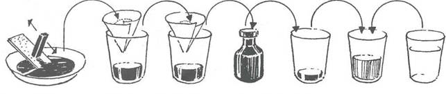
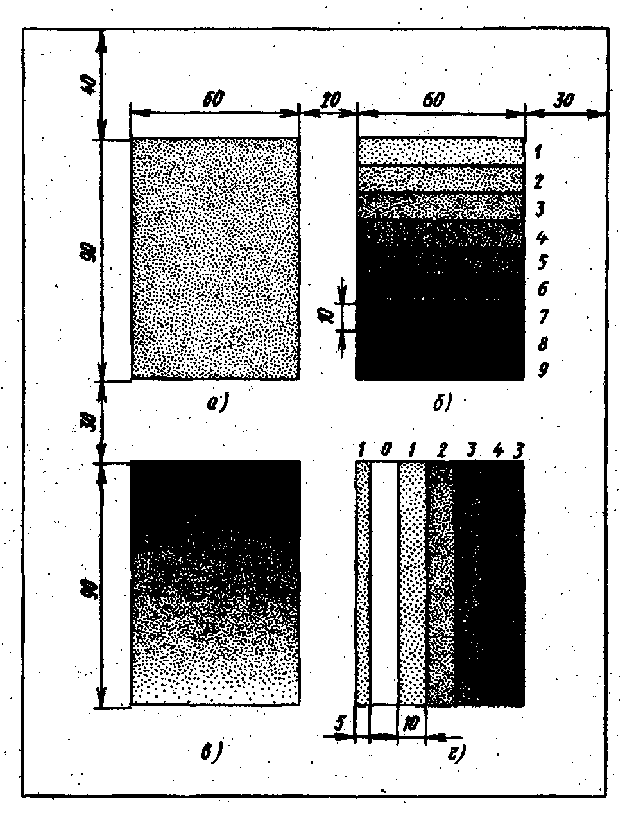

# Методические указания к выполнению практической работы №5

## Тема: Классическая отмывка

**Цель работы:** Формирование умений по выполнению техники классической отмывки чертежей.

**Задачи работы:**

*   закрепить знания по технике выполнения эскизов и чертежей проектируемых объектов;
*   привить умения по выполнению приемов техники классической отмывки чертежей.

**Материально-техническое оснащение:**

*   чертежные принадлежности;
*   ватман формат А4;
*   подрамник;
*   [акварель](GLOSSARY.md#акварель), [тушь](GLOSSARY.md#тушь), кисти.

### 1 Общие теоретические сведения

Завершающий этап работы над чертежом - [отмывка](GLOSSARY.md#отмывка). Отмывкойназывается светотеневая [моделировка](GLOSSARY.md#моделировка) чертежа с помощью прозрачных материалов - сухой туши или акварельных красок, которые наносятся на бумагу либо ровным слоем, либо с постепенным переходом от светлого к темному или наоборот (растяжка тона). Правильно выполненная [отмывка](GLOSSARY.md#отмывка) дает наглядное представление об объемно-пространственной структуре здания, материале, геометрической форме, тоне, цвете, т.е. предельно приближает [чертеж](GLOSSARY.md#чертеж) к натуре.

Относительная простота и доступность отмывки делают ее одним из основных приемов, усваивающихся в начальной стадии академического обучения, для выполнения отмывки необходимы: сухая или жидкая [тушь](GLOSSARY.md#тушь) или [акварель](GLOSSARY.md#акварель), набор кистей с упругим волосом и тонкими концами и хорошо проклеенная чертежная бумага типа ватман или полуватман.

Отмывку следует выполнять на натянутой на подрамник до начала вычерчивания бумаге. Процесс отмывки также ведется по стадиям. Первая стадия отмывки заключается в предварительном наложении одним легким тоном собственных и падающих тоней для разграничения освещенных и затененных частей поверхности изображаемого здания. После того как бумага полностью просохла и вновь натянулась на подрамнике, приступают ко второй стадии отмывки - выявлению уда ленных и приближенных поверхностей, проработке теней и отделению [фона](GLOSSARY.md#фон). Третья стадия включает окончательное тональное расчленение планов, моделировку формы, проработку рисунка лепки и мелких архитектурных деталей, выявление фактуры материала и тона поверхностей. В зависимости от характера архитектурного объекта и замысла исполнителя может варьироваться и характер отмывки - от мягкой и легкой до контрастной и сочной. В первых работах рекомендуется использовать более широкую растяжку тонов и полутонов - это содействует воспитанию зрительного ощущения тона и развитию техники выполнения отмывки. Кроме того, использование большей растяжки тонов полнее передает характеристику объекта и воздушную перспективу.

Тушевая отмывка наиболее наглядный вид архитектурной графики. Она дает возможность передать глубину пространства, объемность форм, рельефность деталей, фактуру, цвет.

Тушевая отмывка применяется в изображении деталей, фасадов, архитектурных разрезов, перспектив.

Архитектурный рисунок или чертеж с выявлением объема, цвета, света и тени ставят перед их исполнителем задачи, не свойственные живописи. Во-первых, в рамках общей стилистики графической подачи архитектурных проекций (фасадов, интерьеров, деталей) их колористика имеет, как правило, очень сдержанную интенсивность. Во-вторых, характер ввода цвета наряду с монохромной демонстрацией объема и освещенности определяется не как живопись, а скорее как покраска, требующая особой внимательности, аккуратности, точности и последовательности в работе.

Как правило, объектом архитектурной отмывки является [чертеж](GLOSSARY.md#чертеж) фасада, перспективы внешнего вида или интерьера, архитектурной детали. Намерение их выполнения в отмывке отражается на выборе бумаги с прочной фактурной поверхностью, выдерживающей многократное смачивание, что должно быть проверено. Затем бумага натягивается на подрамник.

Перед отмывкой все чертежи полностью завершаются и обводятся тонкой линией разведенной водостойкой тушью. Лучшим материалом для устойчивой обводки и последующей отмывки является китайская [тушь](GLOSSARY.md#тушь) в палочках.

Если предполагается ввод в чертеж цвета, то [колерная](GLOSSARY.md#колер) [отмывка](GLOSSARY.md#отмывка) выполняется только после монохромной.

Базовый раствор туши готовят по следующей технологии.

Плоское блюдце, 2 стакана, флакон с притертой пробкой и стеклянная пластинка с матовой поверхностью (карманное зеркальце) тщательно моются и обезжириваются. Готовятся также стерильная вата для фильтра и 2 воронки из чистой бумаги. Руки также должны быть чисто вымыты.

*   На дно блюдца наливают немного воды, на его край кладут, придерживая, матовое стекло. Торец палочки туши смачивают в воде и трут о стекло. Полученная черная жидкость стекает в блюдце. Влажным должен быть только торец палочки, в противном случае увлажнение и последующее высыхание разрушит ее. Натирание туши с подливанием воды продолжают до получения раствора нужной консистенции и нужного количества.
*   Для получения базового раствора максимально густого черного цвета [тушь](GLOSSARY.md#тушь) из блюдца фильтруют сначала в чистый стакан через бумажную воронку, отверстие которой закрыто ватным фильтром. Проверка на отсутствие жирового загрязнения раствора осуществляется визуально: о наличии жира свидетельствуют радужные разводы на поверхности раствора. От жира избавляются повторным фильтрованием в чистой воронке или наложением на поверхность раствора ленты газетной бумаги, которая впитывает плавающий жир.
*   Убедившись в чистоте раствора, его переливают во флакон и хранят в холодильнике, ибо это скоропортящееся органическое вещество.
*   Приготовление рабочих растворов также требует стерильности посуды и остальных средств (кистей). Для отмывки должны быть приготовлены по меньшей мере три стакана (банки): два для приготовленных растворов разной насыщенности и один — для чистой воды.
*   Поверхность подрамника с чертежом, предназначенным для отмывки, аккуратно очищается, обезжиривается мягкой резинкой, мякишем свежего белого хлеба, затем промывается кистью с чистой водой.
*   Для однотонной отмывки выявляются ее площадь и конфигурация, а подрамник устанавливается с наклоном 10—20°.

Рисунок 1 - Подготовка базового и рабочего растворов китайской туши для отмывки

Когда бумага окончательно высохнет, но еще остается холодной, можно приступать собственно к отмывке, предварительно опробовав чистоту и интенсивность раствора на пробном листе бумаги и состояние кисти.

Начинать отмывку нужно со светлого раствора ([отмывка](GLOSSARY.md#отмывка) слезой). Не переходя за границы отмываемого участка, кистью по всему фронту горизонтального [контура](GLOSSARY.md#контур) наносится раствор туши, желательно с зубчатой конфигурацией нижнего края, чтобы раствор равномерно распределялся по зубцам. Эта зубчатая [линия](GLOSSARY.md#линия) валика должна постепенно продвигаться вниз параллельно самой себе кистью, которой время от времени пополняется валик раствора.

Окрашивание происходит за счет постепенного стекания раствора вниз с минимальным касанием бумаги кистью. Скопившийся на нижней границе отмываемого участка валик раствора устраняется отжатой кистью. Каждый последующий слой отмывки наносят только после полного высыхания предыдущего, увеличивая постепенно насыщение раствора тушью. Только многократное наложение слоев обеспечивает прозрачность и сочность отмывки. До полного высыхания каждого слоя нельзя менять наклон подрамника, а для равномерности высыхания не рекомендуется ускорять этот процесс вентиляторами, фенами и т.п.

Если на отмытой поверхности появились пятна с волосным черным контуром на границах, значит, жиром загрязнены бумага, раствор, [кисть](GLOSSARY.md#кисть) или вода. Заметим, что бумага особенно чувствительна к загрязнениям в первых слоях отмывки. Однако и впадать в панику при появлении пятен не стоит. Нужно полностью высушить бумагу и промыть [изображение](GLOSSARY.md#изображение) губкой, стараясь сохранить следы чертежа. Незначительные дефекты можно попытаться заретушировать тем же раствором в конце работы.

Отмывка с моделированием объема или поверхности переходной освещенности может выполняться либо приемом ступенчатой [градации](GLOSSARY.md#градация), либо плавным переходом в другую насыщенность с добавлением в состав раствора воды или, наоборот, туши большей концентрации. Эксперимент отмывки от светлого к темному и от темного к светлому покажет вам особенности перехода и разницу приемов. Здесь, как и во всех других разделах дизайна, опробование и анализ вариантов есть самый надежный путь к накоплению опыта. Достижение необходимого по силе различия отмытых участков, выражающих объемность и светотеневые [отношения](GLOSSARY.md#отношения), требует знания законов распределения света (а это начертательная геометрия), терпения и многократной намывки слоев раствора.

Для отмывки профильных архитектурных деталей (обломов) стекание раствора туши вниз по наклонной плоскости должно быть равномерным по горизонтальному фронту, тем более, что [отмывка](GLOSSARY.md#отмывка) архитектурных профилей требует внимания к горизонтальным членениям и неявным изгибам округлых элементов формы (гуська, каблучка, вала, полувала...). Профиль изгиба фиксируется горизонтальными линиями изофот в карандаше, видимыми при первых слоях моделирующей отмывки; в последующем они размываются, как и карандашный набросок в акварели.

Для отмывки используются несколько различных по светлоте и силе тона растворов. Для работы нормально иметь три-пять разных [градаций](GLOSSARY.md#градация) тушевого раствора. Размывочный способ состоит в том, что поверхность отмывки покрывается светлым раствором с натеком, причем в последовательно спускаемый вниз горизонтально направленный натек постепенно добавляются все более темные тона тушевого раствора.

### 2 Задание

2.1 Выполнить упражнение в технике отмывка послоевым способом.

2.2 Выполнить упражнение в технике отмывка размывочным способом.

### 3 Порядок выполнения работы

На листе формата А4 (210-297) размечают карандашом четыре равных прямоугольника. Первый прямоугольник отмывают ровным светлым тоном туши в два – три приема; второй – с постепенным переходом от светлого к темному (или наоборот). Этот способ отмывки называют слоевым. Второй прямоугольник разбивают на некоторое число горизонтальных полос. Первым очень слабым тоном раствора туши покрывают весь прямоугольник. После просыхания первого вторым слоем того же раствора покрывают участок прямоугольника, исключая первую узкую полосу. Затем таким же образом третий участок и т. Д. после нанесения нескольких слоев раствора туши образуется постепенное усиление тона от светлого к темному.

Третий прямоугольник отмывают с плавным переходом от темному к светлому. В этом случае применяют другой способ отмывки – [размывный](GLOSSARY.md#размывка), который сложнее первого, но [отмывка](GLOSSARY.md#отмывка) выполняется значительно быстрее. Отмывку начинают от верхней кромки прямоугольника раствором туши довольно темного тона; этим тоном закрашивают примерно ¼…1/5 его часть. Затем в раствор добавляют немного воды, перемешивают его и этим слегка высветленным тоном окрашивают следующий небольшой участок, не давая высохнуть предыдущему. В результате раствор туши постепенно высветляется. [тон](GLOSSARY.md#тон) отмывки светлеет книзу и доходит до самого светлого.

В четвертом упражнении предлагается отмыть цилиндрическую выпуклую поверхность при ее освещении слева тем же способом, которым была выполнена [отмывка](GLOSSARY.md#отмывка) второго прямоугольника. Прямоугольник разбивают на семь вертикальных полос. Крайние слева и справа – шириной 5 мм. Средние – 10 мм. Цифры. Проставленные сверху, показывают количество слое, которые необходимо последовательно на листе один на другой. Самое светлое место (блик) не прекращают. Самое темное прокрашивают 4 раза.

> Упражнение выполняется на бумаге формата А4.

### 4 Контрольные вопросы

4.1 Чем отличается слоевой способ отмывки от размывного?

4.2 Какие цвета называют ахроматическими, а какие хроматическими?

### Пример выполнения практического задания

