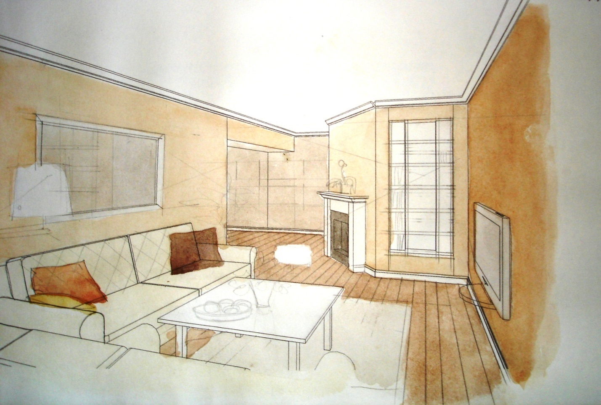

# Методические указания к выполнению практической работы №6

## Тема: Эскиз интерьерного объекта в монохромной технике

**Цель работы:** Выполнить эскиз интерьерного объекта в монохромной технике.

**Задачи работы:**

*   закрепить знания по технике выполнения эскизов проектируемых объектов;
*   привить умения по выполнению эскиза интерьера в монохромной технике.

**Материально-техническое оснащение:**

*   ватман формат А3;
*   [тушь](GLOSSARY.md#тушь), чертежное перо;
*   цветные [карандаши](GLOSSARY.md#карандаш), [акварельные](GLOSSARY.md#акварель) краски;
*   кисти № 3,8 (круглые), 25мм (плоская).

## 1 Общие теоретические сведения

_Монохромное тонирование._ Тонирование в линейной графике связано с необходимостью получить глухие поверхности при изображении объекта. Например, при моделировании формы и пластики сооружения, при выявлении воздушной перспективы и обозначения применяемых строительных материалов. Из арсенала монохромного тонирования чаще всего применяются [заливка](GLOSSARY.md#заливка) и [тамповка](GLOSSARY.md#тамповка).

_Заливка_ – равномерное покрытие бумаги чертежной тушью (для получения глухих неосвещенных поверхностей), водным раствором китайской туши или акварели (для достижения впечатления освещенности и светлой окраски плоскостей.

_Тамповка_ – покрытие поверхности густыми кроющими материалами, чаще всего [гуашью](GLOSSARY.md#гуашь).

Инструменты, применяемые при заливке, могут быть колонковая [кисть](GLOSSARY.md#кисть), рапидограф, чертежное перо, тонкая деревянная палочка. Выбор делается в соответствии с видом и масштабом изображения. Чертежную [тушь](GLOSSARY.md#тушь) следует разбавить водой, даже если необходимо получить абсолютно черную поверхность. Следует помнить, что такая графическая техника применима на бумаге, натянутой на подрамник.

Для выполнения тамповки необходимо приготовить поролоновую губку, которая будет использоваться в качестве тампона и шаблон, закрывающий места на листе, куда не должна попасть краска. При работе губку можно держать в пальцах, а можно привязать ниткой к кончику недлинной палочки и пользоваться этим как своеобразной ручкой. Полученный инструмент осторожно обмакнуть в предварительно выложенный на лист плотной бумаги кроющий [материал](GLOSSARY.md#материал) и сделать пробное тампование до получения ровных отпечатков. Закрыв шаблоном поле вокруг основного изображения, можно приступать к чистовой работе. Тампование проводим осторожно, последовательно перемещаясь по поверхности, до полного ее окрашивания. Для получения однородной поверхности достаточно одного слоя. Если необходим эффект «растяжки», то для перехода от темного к светлому уменьшаем шаг тампования, оставляя неокрашенные участки. Затамповав слой, необходимо дать ему хорошо просохнуть и сделать второй и третий слой, если это нужно. Тамповнием можно получать текстурные изображения, используя различные сетки. Нанесение красочного слоя через сетку проводится по тем же правилам. Сетка снимается осторожно во избежание размазывания краски. В любом случае кляксы и подтеки недопустимы. Количество слоев зависит от требуемого тона и визуальных эффектов, которые нужно получить.

[Заливка](GLOSSARY.md#заливка) и [тампование](GLOSSARY.md#тамповка) позволяют наносить краску корпусно, предметно, работая крупными отношениями линий и пятен. Это позволяет получать лаконизм, плоскостность, материальность изображаемого интерьерного объекта.

### 2 Задание

2.1 Выполнить эскиз интерьера в монохромной технике.

### 3 Порядок выполнения работы

При выполнении этого упражнения используйте ранее выполненный [эскиз](GLOSSARY.md#эскиз) интерьера.

На формат А3 акварельной бумаги переведите эскиз интерьера. Острым карандашом тщательно обведите весь чертеж. Начните заливку с больших плоскостей и дайте им полностью высохнуть, прежде чем делать что-то еще. Постепенно усиливайте насыщенность от светлого к темному. Залейте цветом детали и [антураж](GLOSSARY.md#антураж). Доработайте чертеж с использованием цветных карандашей. Нанесите цветными карандашами светлые основные цвета. Двигайтесь от одного края листа к другому. Стачивайте [карандаши](GLOSSARY.md#карандаш) и переходите от светлых цветов к темным. Постепенно добавляйте больше цветов, выбирая более темные. Обведите черным карандашом и с его помощью наберите [тон](GLOSSARY.md#тон) по необходимости. Добавьте нужные детали.

### 4 Контрольные вопросы

4.1  Дайте понятие [монохромное тонирование](GLOSSARY.md#монохромное-тонирование).

4.2  Дайте сравнительную характеристику техникам монохромного тонирования, заливка и тампование.

4.3  Назовите, какие инструменты и материалы используют для выполнения эскиза в монохромной гамме?

### Пример выполнения практического задания

