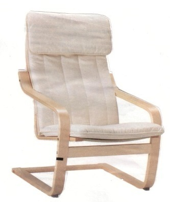
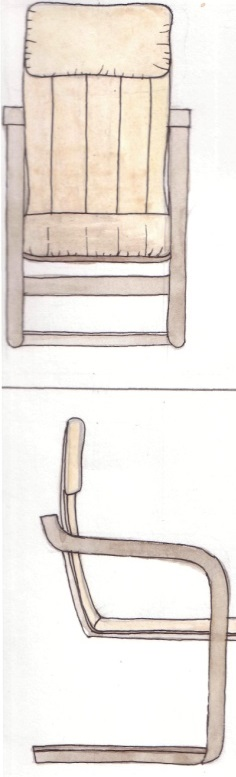
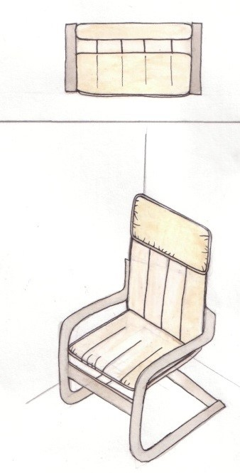

# Методические указания к выполнению практической работы №7

## Тема: Изображение предмета интерьера

**Цель работы:** Освоить приемы графического изображения предмета интерьера в проекциях и аксонометрии

**Задачи работы:**

*   закрепить знания по технике выполнения эскизов и чертежей проектируемых объектов предметов интерьера;
*   привить умения по выполнению проектного изображения предметов интерьера с фактурной передачей материалов.

**Материально-техническое оснащение:**

*   чертежные принадлежности;
*   ватман формат А3;
*   [тушь](GLOSSARY.md#тушь), чертежное перо;
*   краски, кисти, цветные [карандаши](GLOSSARY.md#карандаш).

### 1 Общие теоретические сведения

Одним из интереснейших приемов достижения выразительности, изображения формы объектов предмета интерьера является использование фактуры материалов.

**Фактура** — это совокупность различных технических приемов обработки материальной поверхности, особенности отделки или строения поверхности какого-либо материала, способствующие достижению художественно-декоративной выразительности предмета.

Многие промышленные изделия, которые разрабатываются для серийно-массового производства, проектируются не из одного, а из нескольких материалов. Художник-конструктор, архитектор, конструктор, проектировщик должны знать декоративные свойства материалов, применяемых в конкретном изделии или ансамбле, уметь сочетать их так, чтобы каждый из них получил как можно большую художественную выразительность.

Иллюзии передачи фактуры любого материала можно достичь имитацией, подражанием. При высоком уровне мастерства бывает трудно отличить настоящий [материал](GLOSSARY.md#материал) от его имитации.

В качестве облицовочных в современной практике применяют также искусственные материалы, имитирующие цвет, рисунок и фактуру природных материалов.

Для светлых тонов дерева основой является светлая охра, к ней добавляется небольшое количество красного, зеленоватого или коричневого цвета. Основа для темных тонов дерева — коричневые цвета с добавлением красных, синих и фиолетовых. Чтобы ясно представить себе, какими должны быть соотношения цветов и характер рисунка того или иного дерева, нужно иметь перед собой образец настоящего дерева, которое надо изобразить. Для деревянной текстуры характерны продольные волокна, сучки, заплывы.

Для пластмассы и мрамора характерны разводы и прожилки цвета, гармонирующего с основным. Для мрамора характерна текучесть рисунка. Рисунок гранита зернистый. Кожа и коже заменители обладают пористой структурой, своеобразным рисунком, цветотоновой игрой.

Для реалистичного изображения предмета интерьера необходимо выполнить многоцветный чертеж - ортогональные проекции — вид спереди, вид сбоку, сверху и аксонометрию. При помощи светотени передать внешний его вид, облик.

Многоцветное (полихромное) изображение выполняется акварелью, гуашью или темперой. [Акварель](GLOSSARY.md#акварель) используется как прозрачный лессировочныи [материал](GLOSSARY.md#материал), а [гуашь](GLOSSARY.md#гуашь) и [темпера](GLOSSARY.md#темпера) — как кроющие материалы, покрывающие бумагу непрозрачным слоем. Это различие между материалами очень важно учитывать. Лессировочная техника применяется при изображении фактуры многих материалов, при передаче бликов на поверхности и т. д. Корпусная покраска гуашью передает плотный цвет предмета и фактуру материала без бликов. Гуашь — довольно трудный материал. Внешний вид плоскости, окрашенной гуашью, зависит от способа наложения краски на бумагу. Поверхность, полученная тампонованием (нанесение краски губкой), отличается от поверхности, покрытой при помощи флейца или напыления. При работе гуашью надо помнить, что нельзя накладывать на бумагу повторный слой при помощи кисти, так как она размывает нижний слой. Кроме того, толстый красочный слой мешает прорисовывать мелкие детали, проводить поверх него тонкие линии.

Какие же графические и технические приемы может применять художник-конструктор для выполнения проекта в цвете? Есть несколько способов выполнения этого задания.

Наиболее распространенный из них — выполнение проекта кистью акварельными красками. Художник может довольно точно передать цвет и [свет](GLOSSARY.md#cвет), тени, полутени, блики и фактуру материала.

Второй способ — нанесение краски губкой. В этом случае на готовый карандашный рисунок, выполненный на планшете, резиновым клеем наклеивается калька. Важно, чтобы между бумагой и калькой не было ни одного пузырька. Для этого нужно разгладить кальку во время наклеивания линейкой, угольником (можно использовать пластмассовую расческу). Спустя пять-десять минут лезвием или хорошо заточенным медицинским скальпелем точно по рисунку вырезается та часть, которую нужно закрасить. Резиновый клей легко снимается, если его потереть пальцем. На чистую бумагу поролоновой губкой наносится [колер](GLOSSARY.md#колер), заранее разведенный до нужной густоты. Получается ровная бархатистая поверхность. Этот процесс можно несколько механизировать, применив аэрограф — прибор для нанесения краски в распыленном виде. Краски разбрызгиваются с помощью сжатого воздуха из пульверизатора.

Этим способом можно достичь убедительной передачи фактуры материала, игры цвета и света, объема. Однако для работы с аэрографом нужна сноровка. [Колер](GLOSSARY.md#колер) разводится так, чтобы он мог пройти через отверстие пульверизатора. После каждой зарядки краской пульверизатор нужно тщательно промыть.

Проект можно выполнить в цвете и комбинированным способом. Сначала акварельной кистью, а потом в нужных местах подправить аэрографом или затампоновать поролоновой губкой с последующим задуванием.

Специфика графического моделирования деталей интерьера имеет свои отличительные особенности – она менее условна, чем [графика](GLOSSARY.md#графика) проектных архитектурных чертежей, что объясняется своеобразием дизайнерских задач в отделке интерьера. «Натуральное», реалистическое изображение материалов отделки и мебели помогает предвидеть все особенности дизайнерского решения композиции интерьера. Определить особенности его зрительного восприятия в натуре.

### 2 Задание

2.1 Выполнить [чертеж](GLOSSARY.md#чертеж) предмета интерьера по фотографии в 3-х проекциях и аксонометрии.

2.2 Выполнить чертеж предмета интерьера в ортогональной проекции (_вид спереди, вид сбоку, сверху) и аксонометрию_ в полихромной технике с фактурной передачей материала.

### 3 Порядок выполнения работы

На форматах А3 выполнить эскизы предмета интерьера в проекциях и аксонометрии с учетом композиционного размещения на листе. Используя техники и приемы графики, выполнить реалистическое изображение материалов изображаемого предмета интерьера.

### 4 Контрольные вопросы

4.1 Дайте понятие [фактура](GLOSSARY.md#фактура).

4.2 Какие техники и графические приемы используются для фактурной передачи материалов при изображении интерьерного объекта?

### Пример выполнения практического задания

