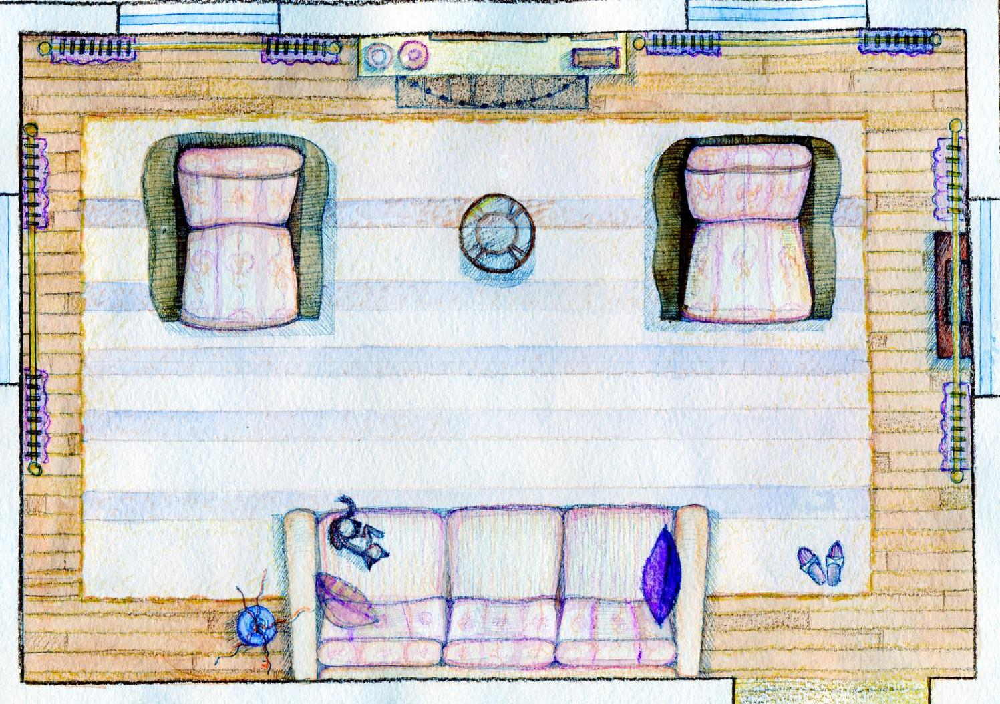

# Методические указания к выполнению практической работы №8

## Тема: План интерьерного объекта в различных техниках

**Цель работы:** Освоение приемов построения плана интерьерного объекта в различных техниках.

**Задачи работы:**

*   закрепить знания техники выполнения эскизов и чертежей проектируемых объектов;
*   привить умения по графическому изображению плана интерьера.

**Материально-техническое оснащение:**

*   чертежные принадлежности;
*   ватман, формат А4;
*   [тушь](GLOSSARY.md#тушь), чертежное перо;
*   цветной карандаш;
*   краски, кисти.

### 1 Общие теоретические сведения

Чертеж плана – условное ортогональное [изображение](GLOSSARY.md#изображение) разреза помещения, рассеченного по горизонтали прозрачной секущей плоскостью при взгляде на него сверху вниз (план). Условная плоскость рассекает помещение таким образом, что на чертежных изображениях плана показаны не только сечения несущих конструкций и перегородок, но и сечения по окнам, дверям. На плане интерьера изображаются предметы мебели и оборудования, элементы декоративного оформления. План выполняется в масштабах 1:100, 1:50, 1:25, 1:10.

### 2 Задание

2.1 Выполнить чертеж плана интерьера в различных техниках.

### 3 Порядок выполнения работы

На формате А4 с учетом выбранного масштаба выполняется чертеж плана интерьерного объекта. Чертеж плана может выполняться исключительно в линейной графике, когда габариты мебели и оборудования, другие элементы наполнения интерьера, горизонтали обозначены линиями. Для выявления композиционных особенностей интерьера применяется тональная или цветная [графика](GLOSSARY.md#графика). Когда с помощью штриховой техники, заливки или тушевой отмывки, акварельной покраски выявляются тени и форма предметов интерьера.

> Упражнение выполняется на бумаге формата А4. 

### 4 Контрольные вопросы

4.1 Дайте определение чертеж плана.

4.2 Перечислите, какие инструменты и материалы используются для выполнения упражнения.

### Пример выполнения практического задания

